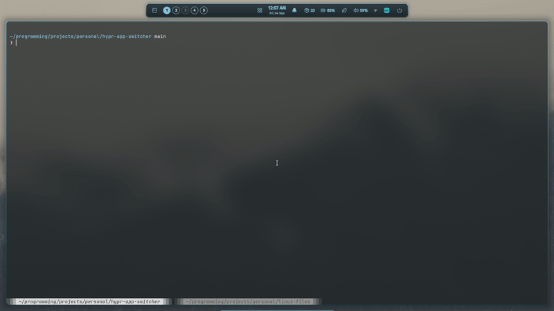

# Hypr App Switcher

A fast, macOS-inspired `<Alt> + <Tab>` application switcher HUD for **Hyprland**, built with **Quickshell**.



---

## Features

- **macOS-Style Quick-Switch:** Rapid taps (< 150ms) switch between your two most recent applications silently in the background with zero visual popup. Holding `<Alt>` past 150ms reveals the carousel HUD.
- **Special Workspace & Scratchpad Support:** Automatically detects and cycles windows inside active special workspaces (e.g. `special:scratchpad`), preserving maximized and fullscreen window states across transitions.
- **Live Wayland Screencopy Previews:** Renders real-time live window mirrors via `Quickshell.Wayland.ScreencopyView` with intelligent lazy-rendering (0% CPU when closed).
- **Matugen Dynamic Accent Sync:** Reads wallpaper palette colors from `~/.config/ml4w/colors/primary` with a dark glassmorphism aesthetic.
- **Auto-Centering Carousel:** Smoothly centers active window cards as you cycle, with fallback icons for headless surfaces.
- **Multi-Monitor Aware:** Activates exclusively on the currently focused monitor.
- **Flexible Controls:** Navigate with `Tab`, Arrow keys, Mouse clicks, or release `Alt` to commit focus.

---

## Installation

### One-Line Install / Update

```bash
bash <(curl -s https://raw.githubusercontent.com/anshifmonz/hypr-app-switcher/main/install.sh)
```

This clones the repository into `~/.local/share/hypr-app-switcher` and sets up the systemd user service.

---

### Manual Installation

1. **Clone the repository:**

   ```bash
   git clone https://github.com/anshifmonz/hypr-app-switcher.git ~/.local/share/hypr-app-switcher
   ```

2. **Enable Systemd Service:**
   ```bash
   mkdir -p ~/.config/systemd/user
   cp ~/.local/share/hypr-app-switcher/systemd/hypr-app-switcher.service ~/.config/systemd/user/
   systemctl --user daemon-reload
   systemctl --user enable --now hypr-app-switcher.service
   ```

---

## Uninstallation

```bash
bash <(curl -s https://raw.githubusercontent.com/anshifmonz/hypr-app-switcher/main/uninstall.sh)
```

This disables and removes the systemd user unit and deletes `~/.local/share/hypr-app-switcher`.

---

## Keybindings

Add the following to your Hyprland configuration:

### For ML4W Lua Keybindings (`~/.config/hypr/conf/keybindings/default.lua`):

```lua
-- Application Switcher
hl.bind("ALT + Tab",         hl.dsp.exec_cmd("qs -p ~/.local/share/hypr-app-switcher ipc call app-switcher next"), { description = "Switch applications on active workspace" })
hl.bind("ALT + SHIFT + Tab", hl.dsp.exec_cmd("qs -p ~/.local/share/hypr-app-switcher ipc call app-switcher prev"), { description = "Switch applications on active workspace (backwards)" })
```

### For Standard Hyprland Conf (`~/.config/hypr/hyprland.conf`):

```conf
# Application Switcher
bind = ALT, Tab, exec, qs -p ~/.local/share/hypr-app-switcher ipc call app-switcher next
bind = ALT SHIFT, Tab, exec, qs -p ~/.local/share/hypr-app-switcher ipc call app-switcher prev
```

---

## Architecture

```text
hypr-app-switcher/
├── assets/
│   ├── demo.gif                  # Visual demo animation
│   └── demo.mp4                  # High-efficiency MP4 recording
├── modules/
│   └── appswitcher/
│       ├── AppSwitcher.qml       # Main switcher HUD & carousel logic
│       └── qmldir                # QML module definition
├── services/
│   ├── GlobalStates.qml          # Switcher open/index state singleton
│   ├── HyprlandData.qml          # Real-time Hyprland socket & IPC sync
│   └── qmldir                    # Service singletons
├── systemd/
│   └── hypr-app-switcher.service # Systemd user unit
├── install.sh                    # Automated setup script
├── uninstall.sh                  # Automated uninstaller
├── shell.qml                     # Quickshell standalone entrypoint
└── LICENSE                       # MIT License
```

---

## Performance

- **Zero Idle Resource Usage:** Screencopy views and event listeners idle completely when the HUD is closed.
- **Fast Startup:** Native QML compilation via Qt6.
- **Wayland Native:** Directly communicates with Hyprland through Unix domain sockets.

---

## License

MIT © [Muhammed Anshif](https://github.com/anshifmonz)
